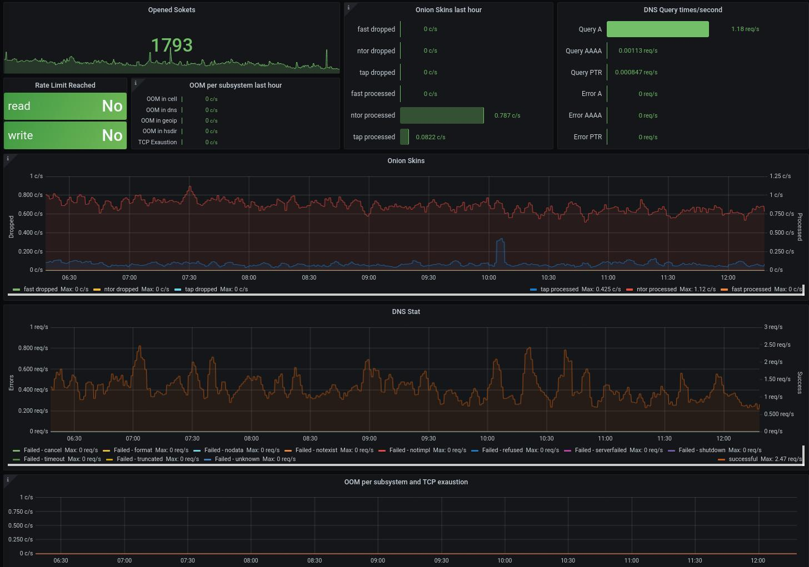

# Tor node Grafana dashboard

Grafana dashboard to display stats from Tor node stored in prometheus DB  
 

## Getting started

Based on [this guide on torproject.org](https://support.torproject.org/id/relay-operators/relay-bridge-overloaded/)<br>
Prometheus exporter is supported only by tor version 0.4.7.1-alpha on time of writing (Oct 2021)

1. Enable prometheus exporter on tor process<br>
    "It's important to understand that exposing tor metrics publicly is dangerous to the Tor network users. Please take extra precaution and care when opening this port. Set a very strict access policy with MetricsPortPolicy and consider using your operating systems firewall features for defence in depth."<br>
    Add or comment following two tines to *torrc* file
    ```text
    ## Prometheus exporter
    MetricsPort x.x.x.x:9035 prometheus
    MetricsPortPolicy accept y.y.y.y
    ```
    *x.x.x.x* is IP address where Tor process will listen for connection from prometheus.<br>
    **DO NOT USE PUBLIC IP THERE**. Use 127.0.0.1 if TOR and prometheus are running at same host<br>
    *y.y.y.y* is IP address from where TOR will accept connections. Keep it as restrictive as possible. Use 127.0.0.1 if TOR and prometheus are running at same host
1. Restart TOR process
1. Configure job for prometheus to scrap data from tor
   Add following to *prometheus.yml* configuration file
   ```yaml
    scrape_configs:  # this line should be already in config
        - job_name: tor-exit
            metrics_path: /metrics
            scheme: http  # https is not yet supported by tor
            static_configs:
            - targets:
                - x.x.x.x:9035
    ```

1. Restart prometheus process
1. Check prometheus console */targets* that prometheus can scrap data from TOR
1. Download [tor_stats.json](https://gitlab.com/TheHolm/tor-node-grafana-dashboard/-/raw/main/tor_stats.json?inline=false) from git repo
1. Go to your grafana and import new dashboard tor_stats.json. Point it to prometheus datasource
