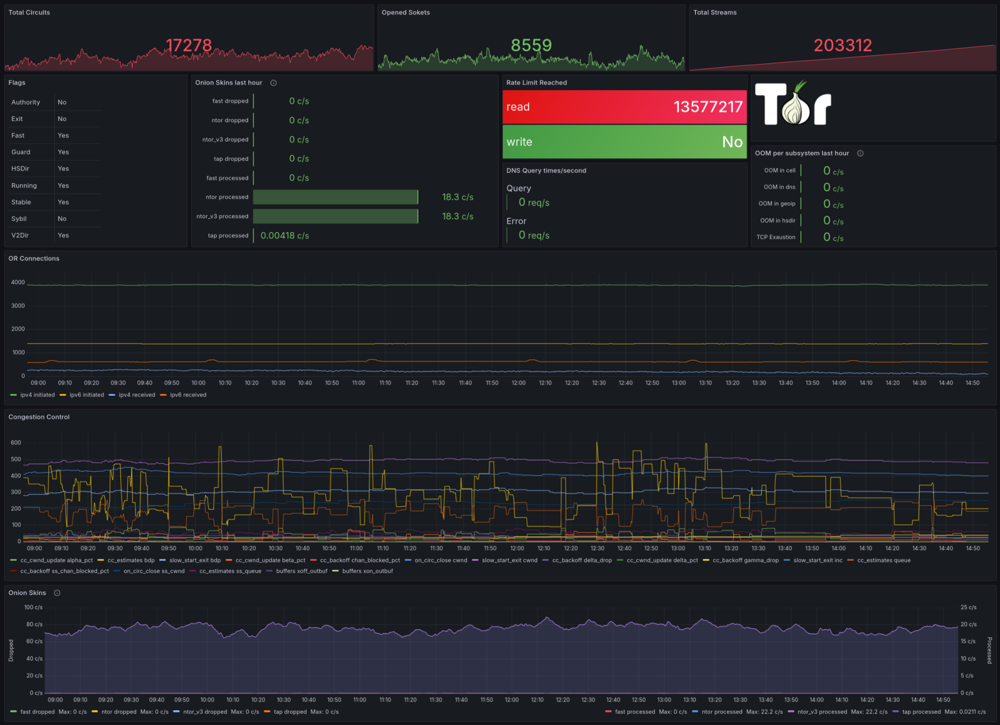

# Tor node Grafana dashboard

**This is a fork of https://gitlab.com/TheHolm/tor-node-grafana-dashboard**

Grafana dashboard to visualize metrics of the Tor-builtin Prometheus exporter.


This is based on [this guide on torproject.org](https://support.torproject.org/relay-operators/relay-bridge-overloaded/)<br>

Here is what you need to do:

## Enable Tor's Prometheus exporter
> It's important to understand that exposing tor metrics publicly is dangerous to the Tor network users. Please take extra precaution and care when opening this port. Set a very strict access policy with MetricsPortPolicy and consider using your operating systems firewall features for defence in depth."

Add the following two tines to `/etc/tor/torrc` config file

```text
## Prometheus exporter
MetricsPort x.x.x.x:9035 Prometheus
MetricsPortPolicy accept y.y.y.y
```

*x.x.x.x* is the IP address on which Tor will listen for incoming connections of Prometheus.<br>
**ONLY USE A PUBLIC IP IF YOU NOT WHAT YOU'RE DOING**. Use 127.0.0.1 if Tor and Prometheus are running on the same host<br>
*y.y.y.y* is the IP address from which Tor will accept connections. Keep this as restrictive as possible. Use 127.0.0.1 if Tor and Prometheus are running on same host


Then reload Tor by running `systemctl reload tor.service`.

## Configure Prometheus to scrape the Tor exporter
Add following to *Prometheus.yml* configuration file
```yaml
scrape_configs:  # this line should be already in config
  - job_name: tor-exit
    metrics_path: /metrics
    scheme: http  # https is not yet supported by tor
    static_configs:
    - targets:
      - x.x.x.x:9035
```

Then reload Prometheus by running `systemctl reload prometheus.service`. You should now find `tor_*` metrics in
Prometheus.

## Import the Grafana dashboard
Finally, download
[tor_stats.json](https://raw.githubusercontent.com/kunfoo/tor-grafana-dashboard/refs/heads/fork/tor_stats.json) from this
repository and import it as a new dashboard in Grafana. Point it to your Prometheus data source.
